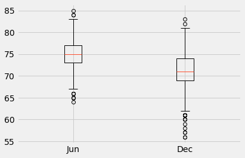

# surfs_up

### Introduction
In this challenge we looking into a few key aspects of Oahu's seasonal weather data. This will be used to looking into wheather opening up a surf shop is a good idea. The goals are to look at key statistical data about the months of June and December using a describe() method.

### Resources

Data Source: hawaii.sqlite
Software: pandas, mumpy, datetime, matplotlib, sqlalchemy, python, flask

### Summary

From the data we see that:

- June has 183 more data points than December

- June has a mean that is 3.9 degree F higher than December

- June has a smaller std of 3.25 than December's 3.74

- June has a higher min of 64 degree F than December's 56 degree F

- June has a higher max of 85 degree F than December's 83 degree F

This can be visualized in the boxplot below:

### Future Analysis
In the future the following extra analysses can also be done:
- Plotting the same data over the course of the year to check to see if the temperature remains stable throughout the entire year. Then plan accordingly if certain months have conditions not suitable for surfing.
- Calculate and plot the average daily rainfall based off of the historcal data.
- Plot the average temp and rain per station to find if there are any data differences between locations.
